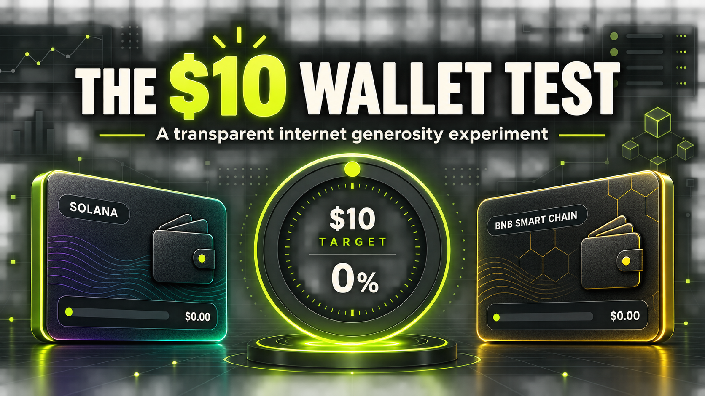

# The $10 Wallet Test / 十美元钱包实验



Can tiny gifts from the internet take two empty crypto wallets to a combined **$10**?

陌生人的微小善意，能否让两个余额为零的钱包合计达到 **10 美元**？

## [Open the donation page / 打开募捐页](https://mundodr.github.io/ten-dollar-wallet-test/)

[Verified public Nostr post / 已验证的公开 Nostr 帖](https://njump.me/nevent1qgsg9220zgkt5xayx7pjm0rmf4v9lzuzhtazp9yrs5xtwyumdzfwslspz3mhxue69uhhyetvv9ujuerpd46hxtnfduqs6amnwvaz7tmwdaejumr0dsq3vamnwvaz7tmjv4kxz7fwwpexjmtpdshxuet5qqswll6xuzxwgu76245csdsxkkp0q30tmu3dmqskcvw2qsxq8ggl8fgxygtz7)

This is an honest public experiment—not a charity, hardship claim, token sale, raffle, or investment. Any transfer is a voluntary personal gift with no goods, services, tax receipt, or financial return promised.

这是一个公开、真实的小实验，不是慈善项目，不编造困难，也不销售代币或承诺回报。任何转账都是自愿的个人赠与。

## Wallets / 钱包

### Solana

Accepts **SOL** and **USDC (SPL)** on the Solana network only.

```text
o9mfxQnHja71MNvU81gdx4VtFaYRGxGFLKDjPJKiPYt
```

[Verify on Solscan](https://solscan.io/account/o9mfxQnHja71MNvU81gdx4VtFaYRGxGFLKDjPJKiPYt)

### BNB Smart Chain

Accepts **BNB**, **USDT**, and **USDC** on BNB Smart Chain (BEP-20) only.

```text
0x4244f335c42ebd82dbd1378a9cb192f582d9ad18
```

[Verify on BscScan](https://bscscan.com/address/0x4244f335c42ebd82dbd1378a9cb192f582d9ad18)

## Transparency / 透明度

- Starting native balances were verified as zero on 2026-08-27.
- The public page includes both QR codes and block-explorer links.
- A scheduled workflow checks both chains every 30 minutes and updates the public snapshot when displayed balances change.
- Block explorers are always the authoritative record.

If this honest little experiment made you smile, send a dollar—or less. Every tiny amount counts.

如果这个诚实的小实验让你会心一笑，可以送一美元，或更少。任何小额赠与都有帮助。
